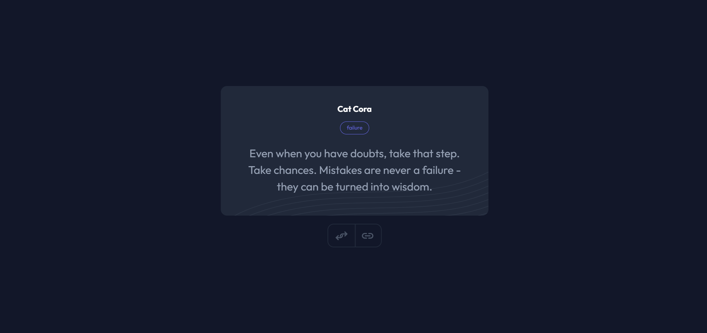

# Random Quote 🎉

## Descripción 📖
**Random Quote** es una aplicación web que genera citas aleatorias de una API externa y permite compartirlas en redes sociales. Esta aplicación está diseñada para ser completamente **responsive**, utiliza buenas prácticas de desarrollo y está estructurada para facilitar su mantenimiento y escalabilidad.


## Características ✨
- **Responsive Design**: Adaptada para ofrecer una experiencia óptima en cualquier dispositivo.
- **Buenas prácticas en CSS**: Uso de **custom properties** y la biblioteca externa [Animate.css](https://animate.style/) para animaciones.
- **Generación dinámica con JavaScript**: El contenido del sitio se genera dinámicamente mediante JavaScript, aprovechando el mínimo HTML.
- **Integración con API**: Uso de `Fetch` y funciones asincrónicas para obtener citas aleatorias desde la API de [API-Ninjas](https://api-ninjas.com/).
- **Código modular**: El código JavaScript está estructurado en diferentes archivos y carpetas para mejorar su organización y mantenimiento.


## Vista Previa



Puedes ver la versión demo en vivo aquí: [Random Quote](https://random-quote-coral-nine.vercel.app/)


## Tecnologías 🛠️
- **HTML**: Para la estructura base del proyecto.
- **CSS**: Para el diseño visual, con el uso de custom properties y animaciones.
- **JavaScript**: Para la lógica del proyecto, incluyendo manejo de eventos, asincronía, y fetch.


## Instalación y Uso 🚀

### 1. Clona este repositorio:
```bash
git clone https://github.com/Ibrahim-003/Random-Quote.git
```

### 2. Abre el archivo `index.html` en tu navegador:
No es necesario un servidor adicional, ya que la aplicación es completamente estática.


## Estructura del Proyecto 📂
```
random-quote/
├── css/
│   ├── styles.css          # Estilos principales del proyecto
│   └── reset.css         # Reset de los estilos predeterminados
├── images/
│   ├── desktop-preview.png          # Vista previa
│   └── ....
├── js/
│   ├── api.js              # Funciones para interactuar con la API
│   ├── main.js             # Lógica principal de la aplicación
│   ├── modal.js            # Gestión del modal para compartir
│   ├── quotes.js           # Generación dinámica de las citas
│   └── events.js           # Manejadores de eventos
├── index.html              # Estructura base del proyecto
└── README.md               # Documentación del proyecto
```


## API Utilizada 🌐
**[API-Ninjas Quotes](https://api-ninjas.com/api/quotes)**
Esta API permite obtener citas aleatorias en formato JSON. Para usarla, es necesario una clave de API que puedes generar gratuitamente en el sitio web de API-Ninjas.


## Funcionalidades Principales 🧩
- **Generar una cita aleatoria**:
  Al cargar la página o hacer clic en el botón "Random Quote", se genera una nueva cita obtenida de la API.

- **Compartir en redes sociales**:
  Opciones para compartir citas en LinkedIn, Facebook y Twitter directamente desde la aplicación.


## Autor 👨‍💻
Desarrollado por **[Ibrahim Almeyda](https://github.com/Ibrahim-003)**.
